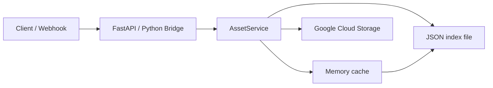

# contabo_storage_manager

> **Lightweight FTP bridge / storage manager for a Contabo VPS.**  
> Receives webhooks from external web apps, persists payloads as timestamped files, and syncs them to vsftpd via FTP – all in a single Docker Compose stack.

Both a **Python (FastAPI)** and a **Node.js (Express)** bridge are provided side-by-side.  
Pick the one you prefer, or run both at the same time.

## Brotli + Gzip Compression (NEW)

The Nginx static file server now includes **Brotli compression** support for efficient delivery of large model files and assets. Compression is automatically enabled for:
- Text (CSS, JSON, plain text)
- JavaScript and WebAssembly (WASM)
- Audio files (FLAC, MP3, WAV, OGG, MIDI)
- Binary assets

**Note:** The nginx container is now built from `Dockerfile.nginx` to include the Brotli module. This replaces the standard `nginx:alpine` image.

**Rebuild after pulling changes:**
```bash
docker compose --profile storage up -d --build
```

---

## Table of Contents

- [Architecture](#architecture)
- [Folder Structure](#folder-structure)
- [Quick Start – Contabo Ubuntu VPS](#quick-start--contabo-ubuntu-vps)
- [Running with Docker](#running-with-docker)
- [Running without Docker (systemd)](#running-without-docker-systemd)
- [Environment Variables](#environment-variables)
- [Webhook Endpoints](#webhook-endpoints)
- [Supported Apps](#supported-apps)
- [Extending the Bridge](#extending-the-bridge)
- [Scripts](#scripts)

---

## Architecture

```
Internet ──→ (nginx / Caddy / direct)
               │
               ├─── :8000  Python Bridge (FastAPI)
               │             ├── GET  /admin                  ← universal upload dashboard
               │             ├── POST /api/songs/upload       ← audio ingestion
               │             ├── POST /api/notes/write/{name} ← markdown notes
               │             ├── POST /api/shaders            ← shader metadata + code
               │             ├── POST /webhook/generic
               │             ├── POST /webhook/shopify
               │             ├── POST /webhook/github
               │             ├── POST /webhook/image-effects  ← image_video_effects
               │             ├── POST /webhook/sequencer      ← web_sequencer
               │             └── GET  /files/{path}           ← static file server
               │
               ├─── Google Cloud Storage Bucket
               │        └── Syncs to VPS (audio/music/, notes/, shaders/)
               │
               ├─── :3000  Node Bridge (Express)
               │             ├── POST /webhook/generic
               │             ├── POST /webhook/shopify
               │             └── POST /webhook/github
               │
               └─── :8080  Nginx static server (nginx-files container)
                             └── GET /<any-path>              ← serves FILES_DIR directly

All services write to /home/ftpbridge/files  ←── single FTP account, vsftpd served
```

### Upload Architecture

- **Frontend uploads are skipped** in client apps. Instead, all file management happens through:
  1. The **`/admin`** dashboard (drag-and-drop universal uploader)
  2. **Google Cloud Storage** bucket sync (drop files in the bucket and the VPS file watcher auto-indexes them)
- Audio tracks dropped into `audio/music/` are automatically scanned and added to `songs.json` if missing.
- Shader assets are now included in the main `/api/songs` library endpoint and can be synchronized via the storage manager.
- `/api/admin/sync` supports `?type=shader` and now backfills missing `updated_at` values for indexed assets.
- `/api/admin/sync-music` supports optional `?type=music` and keeps music metadata up to date.
- Markdown notes dropped into `notes/` are immediately available via the `/api/notes/` REST endpoints.

### AssetService architecture



### API endpoint examples

- `GET /api/songs` — returns combined library items, including `type=shader` entries.
- `GET /api/shaders` — list shaders with `stars`, `play_count`, `rating_count`, and `thumbnail_url`.
- `GET /api/shaders/{shader_id}` — retrieve one shader metadata entry.
- `POST /api/shaders/{shader_id}/rate` — form field `stars=4` updates average rating.
- `POST /api/shaders/{shader_id}/play` — increments shader play count.
- `POST /api/shaders/upload` — upload `.wgsl` shader code and optional `.png` thumbnail.
- `PUT /api/shaders/{shader_id}` or `POST /api/shaders/{shader_id}/update` — patch shader metadata.
- `POST /api/admin/sync?type=shader` — rebuild the shader index from `shaders/*.wgsl`.
- `POST /api/admin/sync-music?type=music` — refresh the `music` index from Cloud Storage.

### Shader index migration

- Shader metadata is now centralized in `shaders/_shaders.json` and surfaced through `/api/songs`.
- The sync flow auto-discovers missing `.wgsl` shader assets and creates index entries for them.
- Shader IDs are derived from the filename (for example, `shaders/example.wgsl` becomes `example`).
- If a shader entry lacks `updated_at`, it will be backfilled during sync.
- To apply the migration after updating bucket contents, run:
  `curl -X POST "http://localhost:8000/api/admin/sync?type=shader"`

---

## Folder Structure

```
contabo_storage_manager/
├── README.md
├── .env.example
├── docker-compose.yml
├── Dockerfile.python
├── Dockerfile.node
├── pyproject.toml               # Python project metadata & dev deps
├── package.json                 # Node.js root (workspace scripts)
├── packages/
│   ├── shared/                  # Common utilities
│   │   ├── ftp/
│   │   │   ├── ftp_utils.py     # Python FTP helpers
│   │   │   └── ftpUtils.js      # Node.js FTP helpers
│   │   ├── logger/
│   │   │   └── logger.py        # Shared Python logger
│   │   └── config/
│   │       └── config.py        # Shared Python config loader
│   ├── python-bridge/           # FastAPI service
│   │   ├── requirements.txt
│   │   └── app/
│   │       ├── __init__.py
│   │       ├── main.py          # FastAPI app + lifespan
│   │       ├── webhooks.py      # Webhook router
│   │       ├── sync.py          # Background poll loop
│   │       ├── models.py        # Pydantic models
│   │       ├── config.py        # Settings (pydantic-settings)
│   │       ├── logger.py        # Structured logger
│   │       └── ftp_client.py    # FTP upload helpers
│   └── node-bridge/             # Express.js service
│       ├── package.json
│       └── src/
│           ├── index.js         # Express app entry point
│           ├── webhooks.js      # Webhook handlers
│           └── logger.js        # Winston logger
├── scripts/
│   ├── poll_api.py              # Standalone API poller
│   ├── ftp_sync.py              # Sync local dir → FTP
│   └── listFtpFiles.js          # List FTP contents
├── config/
│   ├── vsftpd.conf.example      # vsftpd configuration reference
│   └── nginx.conf.example       # Nginx reverse proxy example
├── systemd/
│   ├── ftpbridge-python.service
│   └── ftpbridge-node.service
└── .gitignore
```

---

## Quick Start – Contabo Ubuntu VPS

> Prerequisites: vsftpd is already installed and serving `/home/ftpbridge/files`.  
> These steps install Docker and launch the bridge in under five minutes.

```bash
# 1. Install Docker + Compose plugin (Ubuntu 22.04 / 24.04)
sudo apt-get update && sudo apt-get install -y ca-certificates curl gnupg
sudo install -m0755 -d /etc/apt/keyrings
curl -fsSL https://download.docker.com/linux/ubuntu/gpg \
  | sudo gpg --dearmor -o /etc/apt/keyrings/docker.gpg
echo "deb [arch=$(dpkg --print-architecture) signed-by=/etc/apt/keyrings/docker.gpg] \
  https://download.docker.com/linux/ubuntu $(. /etc/os-release && echo "$VERSION_CODENAME") stable" \
  | sudo tee /etc/apt/sources.list.d/docker.list
sudo apt-get update && sudo apt-get install -y docker-ce docker-ce-cli containerd.io docker-compose-plugin
sudo usermod -aG docker $USER && newgrp docker

# 2. Clone the repo
git clone https://github.com/ford442/contabo_storage_manager.git
cd contabo_storage_manager

# 3. Set up environment
cp .env.example .env
nano .env   # set FTP_PASS, WEBHOOK_SECRET, etc.

# 4. Ensure the FTP files directory exists
sudo mkdir -p /home/ftpbridge/files
sudo chown -R ftpbridge:ftpbridge /home/ftpbridge/files   # or your FTP user

# 5. Start everything
docker compose --profile full up -d

# 6. Verify
curl http://localhost:8000/health   # Python bridge
curl http://localhost:3000/health   # Node bridge

## Running tests

Install Python dependencies and test tools:

```bash
python3 -m pip install -r packages/python-bridge/requirements.txt
python3 -m pip install pytest pytest-asyncio
```

Run the test suite:

```bash
python3 -m pytest
```

Run a single test:

```bash
python3 -m pytest tests/test_cors.py
```
```

---

## Running with Docker

### Start both services

```bash
docker compose --profile full up -d
```

### Start Python bridge only

```bash
docker compose --profile python up -d
```

### Start Node bridge only

```bash
docker compose --profile node up -d
```

### View logs

```bash
docker compose logs -f python-bridge
docker compose logs -f node-bridge
```

### Stop everything

```bash
docker compose --profile full down
```

### Rebuild after code changes

```bash
docker compose --profile full up -d --build
```

---

## Running without Docker (systemd)

### Python bridge

```bash
# 1. Install Python 3.12+ and create virtualenv
sudo apt-get install -y python3.12 python3.12-venv
python3.12 -m venv .venv
source .venv/bin/activate
pip install -r packages/python-bridge/requirements.txt

# 2. Install the systemd service
sudo cp systemd/ftpbridge-python.service /etc/systemd/system/
sudo systemctl daemon-reload
sudo systemctl enable --now ftpbridge-python

# Check status
sudo systemctl status ftpbridge-python
journalctl -u ftpbridge-python -f
```

### Node bridge

```bash
# 1. Install Node.js 20+ (via nvm or NodeSource)
curl -fsSL https://deb.nodesource.com/setup_20.x | sudo -E bash -
sudo apt-get install -y nodejs

# 2. Install dependencies
cd packages/node-bridge && npm ci --omit=dev && cd ../..

# 3. Install the systemd service
sudo cp systemd/ftpbridge-node.service /etc/systemd/system/
sudo systemctl daemon-reload
sudo systemctl enable --now ftpbridge-node

# Check status
sudo systemctl status ftpbridge-node
journalctl -u ftpbridge-node -f
```

---

## Environment Variables

Copy `.env.example` to `.env` and adjust the values.

| Variable | Default | Description |
|---|---|---|
| `APP_ENV` | `production` | `development` or `production` |
| `FTP_HOST` | `127.0.0.1` | vsftpd host |
| `FTP_PORT` | `21` | vsftpd port |
| `FTP_USER` | `ftpbridge` | FTP username |
| `FTP_PASS` | *(empty)* | FTP password – **always set this** |
| `FTP_UPLOAD_DIR` | `/home/ftpbridge/files` | Root path on the FTP server |
| `FTP_TLS` | `false` | Enable FTPS (`true`/`false`) |
| `WEBHOOK_SECRET` | *(empty)* | HMAC secret – leave empty to disable verification |
| `WEBHOOK_HMAC_ALGO` | `sha256` | HMAC algorithm (`sha256` or `sha1`) |
| `SHADER_GENERATION_TOKEN` | *(empty)* | Required token for `POST /webhook/image-effects/generate-shader-lists` |
| `IMAGE_EFFECTS_REPO_DIR` | `/root/image_video_effects` | Local checkout path used for shader list generation |
| `IMAGE_EFFECTS_SHADER_LISTS_DIR` | `shader-lists` | Relative output folder containing generated shader list JSON files |
| `PYTHON_PORT` | `8000` | Port for FastAPI service |
| `NODE_PORT` | `3000` | Port for Express service |
| `CORS_ORIGINS` | `*` | Comma-separated CORS origins, or `*` for all |
| `CORS_ORIGIN_REGEX` | *(built-in default)* | Regex fallback for trusted browser origins like `*.1ink.us`, `*.noahcohn.com`, and localhost |
| `FILES_DIR` | `/home/ftpbridge/files` | Local volume mount path inside container |
| `LOG_LEVEL` | `info` | `debug`, `info`, `warning`, `error` |
| `LOG_FILE` | `/var/log/ftpbridge/app.log` | Log file path |
| `POLL_INTERVAL_SECONDS` | `60` | How often to poll external API |
| `EXTERNAL_API_URL` | *(empty)* | URL to poll for records |
| `EXTERNAL_API_KEY` | *(empty)* | Bearer token for external API |

---

## Webhook Endpoints

Both bridges expose the same routes. Replace `:PORT` with `8000` (Python) or `3000` (Node).

### Health check

```
GET http://VPS_IP:PORT/health
```

### Generic webhook

Accepts any JSON body with `source`, `event`, and `data` fields.

```bash
curl -X POST http://VPS_IP:PORT/webhook/generic \
  -H "Content-Type: application/json" \
  -H "X-Hub-Signature-256: sha256=$(echo -n '{"source":"myapp","event":"user.created","data":{}}' | openssl dgst -sha256 -hmac 'YOUR_SECRET' | awk '{print $2}')" \
  -d '{"source":"myapp","event":"user.created","data":{"id":1,"email":"user@example.com"}}'
```

### Shopify webhook

```bash
curl -X POST http://VPS_IP:PORT/webhook/shopify \
  -H "Content-Type: application/json" \
  -H "X-Shopify-Topic: orders/create" \
  -H "X-Shopify-Hmac-Sha256: <base64-hmac>" \
  -d '{"id":1234,"email":"customer@example.com","total_price":"49.99"}'
```

### GitHub webhook

```bash
curl -X POST http://VPS_IP:PORT/webhook/github \
  -H "Content-Type: application/json" \
  -H "X-GitHub-Event: push" \
  -H "X-Hub-Signature-256: sha256=<hex-hmac>" \
  -d '{"ref":"refs/heads/main","repository":{"full_name":"org/repo"}}'
```

### Saved file format

Each payload is saved as a timestamped JSON file under `FILES_DIR`:

```
webhooks/
└── shopify/
    └── shopify_orders_create_20240315T143022123456.json
```

---

---

## Supported Apps

The following integrations have dedicated endpoints and organised storage layouts.
All share the **same single FTP account** configured in `.env`.

### Storage layout

```
/home/ftpbridge/files/
├── webhooks/                        # Generic / Shopify / GitHub payloads
│
├── image-effects/
│   ├── shaders/                     # Shader JSON configs
│   ├── metadata/                    # Effect metadata (name, category, tags …)
│   └── outputs/
│       └── YYYY-MM-DD/              # Generated images / videos / depth maps
│
├── audio/
│   ├── music/                       # Canonical music library (FLAC, MP3, WAV, OGG)
│   ├── flac/                        # Legacy FLAC audio files
│   ├── wav/                         # WAV and AIFF audio files
│   ├── covers/                      # Album / track cover art
│   ├── playlists/                   # Playlist JSON
│   └── metadata/                    # Track metadata JSON
│
├── notes/                           # Plain-text markdown notes for rain_edit & cloud_notes
│   ├── *.md                         # Note files (synced from apps or uploaded via /admin)
│   └── webhook/                     # Archived webhook payloads from cloud_notes
│
└── sequencer/
    ├── projects/                    # Full project JSON files
    ├── midi/                        # MIDI files (.mid)
    ├── samples/                     # Audio samples / SoundFonts
    └── recordings/                  # Exported WAV / MP3 recordings

└── clip-stacker/
    ├── projects/                    # Clip-stacker project JSON files
    └── media/                       # Uploaded media files (MP4, WAV, MP3)
```

---

### 1. image_video_effects

[github.com/ford442/image_video_effects](https://github.com/ford442/image_video_effects)

**Endpoint:** `POST /webhook/image-effects`
**Content-Type:** `application/json`

| `action` field | Stored at |
|---|---|
| `save_shader` | `image-effects/shaders/<name>.json` |
| `save_metadata` | `image-effects/metadata/<name>.json` |
| `save_output` | `image-effects/outputs/YYYY-MM-DD/<name>.json` |

**Example — save a shader config:**

```bash
PAYLOAD='{"action":"save_shader","name":"chromatic-aberration","data":{"type":"fragment","uniforms":{"strength":0.8}}}'
SIG=$(echo -n "$PAYLOAD" | openssl dgst -sha256 -hmac 'YOUR_SECRET' | awk '{print $2}')

curl -X POST https://VPS_IP:8000/webhook/image-effects \
  -H "Content-Type: application/json" \
  -H "X-Hub-Signature-256: sha256=$SIG" \
  -d "$PAYLOAD"
```

**Example — save output metadata:**

```bash
PAYLOAD='{"action":"save_output","name":"sunset-render","data":{"width":1920,"height":1080,"format":"webp"}}'
SIG=$(echo -n "$PAYLOAD" | openssl dgst -sha256 -hmac 'YOUR_SECRET' | awk '{print $2}')

curl -X POST https://VPS_IP:8000/webhook/image-effects \
  -H "Content-Type: application/json" \
  -H "X-Hub-Signature-256: sha256=$SIG" \
  -d "$PAYLOAD"
```

**Configure in your app:**

```js
const STORAGE_URL = "https://VPS_IP:8000";
await fetch(`${STORAGE_URL}/webhook/image-effects`, {
  method: "POST",
  headers: {
    "Content-Type": "application/json",
    "X-Hub-Signature-256": `sha256=${hmacSha256(secret, body)}`,
  },
  body: JSON.stringify({ action: "save_shader", name: shaderName, data: shaderObj }),
});
```

**Generate and upload shader lists from VPS:**

```bash
curl -X POST https://VPS_IP:8000/webhook/image-effects/generate-shader-lists \
  -H "X-Webhook-Token: YOUR_SHADER_GENERATION_TOKEN"
```

This endpoint will:
- run `git -C IMAGE_EFFECTS_REPO_DIR pull --ff-only`
- run `node scripts/generate_shader_lists.js`
- copy `IMAGE_EFFECTS_SHADER_LISTS_DIR/*.json` to `image-effects/shader-lists/` in storage
- upload copied files to external FTP/SFTP when configured

---

### 2. flac_player

[github.com/ford442/flac_player](https://github.com/ford442/flac_player)

`flac_player` is now a **read-only client**. It does not upload files directly. Instead, it streams from `storage.noahcohn.com` and relies on the Storage Manager for library management.

**Upload options:**
1. Open `https://storage.noahcohn.com/admin` and drag audio files into the upload dashboard.
2. Drop `.flac` or `.mp3` files directly into the connected Google Cloud Storage bucket under `audio/music/`. The VPS file watcher will auto-detect them, assign a UUID, generate a default title, and append them to `songs.json`.

**API endpoints used by the player:**

```
GET  /api/songs              # list library
GET  /api/songs/{id}         # track metadata
GET  /api/music/{id}         # stream audio file
POST /api/songs/{id}/play    # record play event
```

**Load a track in the player:**

```js
const STORAGE = "https://storage.noahcohn.com";
const audio = new Audio(`${STORAGE}/api/music/abc12345`);
audio.play();
```

---

### 3. web_sequencer

[github.com/ford442/web_sequencer](https://github.com/ford442/web_sequencer)

**Endpoint:** `POST /webhook/sequencer`
**Content-Type:** `application/json` **or** `multipart/form-data`

| `action` | Content-Type | Stored at |
|---|---|---|
| `save_project` | `application/json` | `sequencer/projects/<name>.json` |
| `upload_midi` | `multipart/form-data` | `sequencer/midi/` |
| `upload_sample` | `multipart/form-data` | `sequencer/samples/` |
| `upload_recording` | `multipart/form-data` | `sequencer/recordings/` |

**Example — save a full project:**

```bash
PAYLOAD='{"action":"save_project","name":"my-track","data":{"bpm":120,"tracks":[]}}'
SIG=$(echo -n "$PAYLOAD" | openssl dgst -sha256 -hmac 'YOUR_SECRET' | awk '{print $2}')

curl -X POST https://VPS_IP:8000/webhook/sequencer \
  -H "Content-Type: application/json" \
  -H "X-Hub-Signature-256: sha256=$SIG" \
  -d "$PAYLOAD"
```

**Example — upload a MIDI file:**

```bash
curl -X POST https://VPS_IP:8000/webhook/sequencer \
  -F "action=upload_midi" \
  -F "file=@bassline.mid"
```

**Example — upload an audio sample:**

```bash
curl -X POST https://VPS_IP:8000/webhook/sequencer \
  -F "action=upload_sample" \
  -F "file=@kick.wav"
```

**Example — upload an exported recording:**

```bash
curl -X POST https://VPS_IP:8000/webhook/sequencer \
  -F "action=upload_recording" \
  -F "file=@final-mix.mp3"
```

**Load project / MIDI back in the sequencer:**

```js
const STORAGE = "https://storage.yourdomain.com";

// Load saved project JSON
const res = await fetch(`${STORAGE}/sequencer/projects/20260325T120000_my-track.json`);
const project = await res.json();

// Load a MIDI file
const midiRes = await fetch(`${STORAGE}/sequencer/midi/20260325T120000_bassline.mid`);
const midiBuffer = await midiRes.arrayBuffer();
```

---

### 4. rain_edit & cloud_notes (Shared Note API)

Both `rain_edit` and `cloud_notes` use the same `/api/notes/` REST API for storage and retrieval. Notes are stored as plain-text Markdown files directly on the VPS.

**Storage:** `files/notes/<name>.md`

Notes are exposed through a simple REST API and are also watched by the file watcher, so dropping `.md` files into the Google Bucket under `notes/` makes them instantly available.

**REST API Endpoints (shared):**

| Method | Path | Description |
|---|---|---|
| `GET` | `/api/notes/list` | List all notes (sorted by modified time) |
| `GET` | `/api/notes/read/{note_name}` | Read a note by name (no `.md` extension needed) |
| `POST` | `/api/notes/write/{note_name}` | Create or overwrite a note |
| `POST` | `/api/notes/save` | Save note with human-readable title (auto-slugified) |
| `POST` | `/api/notes/sync` | Sync a cloud_notes payload (for direct browser sync) |
| `POST` | `/api/notes/sync/batch` | Batch sync multiple notes in one request |
| `DELETE` | `/api/notes/delete/{note_name}` | Delete a note |

**Example — write a note:**

```bash
curl -X POST https://VPS_IP:8000/api/notes/write/project-ideas \
  -H "Content-Type: application/json" \
  -d '{"content": "- Build a universal upload dashboard\n- Sync GCS bucket to VPS automatically"}'
```

**Example — read a note:**

```bash
curl https://VPS_IP:8000/api/notes/read/project-ideas
```

**Example — save a note with a title:**

```bash
curl -X POST https://VPS_IP:8000/api/notes/save \
  -H "Content-Type: application/json" \
  -d '{"title": "Project Ideas", "content": "- Build universal upload dashboard", "tags": "todo"}'
```

**Upload via admin dashboard:**

Drag any `.md` file into `https://storage.noahcohn.com/admin` and it will be routed to `/api/notes/write/{filename}` automatically.

---

### 5. cloud_notes

[github.com/ford442/cloud_notes](https://github.com/ford442/cloud_notes)

`cloud_notes` is a browser-based note-taking app that syncs with the Storage Manager for centralized data persistence. It uses the shared `/api/notes/` REST API and includes support for direct browser-to-server sync without needing HMAC signatures.

**Endpoints:**

- **REST API:** Uses the same `/api/notes/*` endpoints as rain_edit (see above)
- **Webhook:** `POST /webhook/notes` — for webhook-based sync with encrypted content support
- **Direct Sync:** `POST /api/notes/sync` — for browser-based direct sync without signatures

**Storage:** `files/notes/`

Notes are stored as Markdown files with frontmatter metadata. The app can also sync via the webhook endpoint, which archives payloads in `notes/webhook/` for audit trails.

**Webhook Integration:**

The `cloud_notes` app can send notes to `POST /webhook/notes` for webhook-based sync. This endpoint:
- Does NOT require HMAC signature verification (safe for browser-to-server)
- Accepts encrypted content (marked with `ENC:v1:` prefix)
- Archives JSON payloads in `notes/webhook/` for record-keeping
- Saves extracted notes as Markdown files in `notes/`

**Example — webhook sync from cloud_notes:**

```bash
curl -X POST https://VPS_IP:8000/webhook/notes \
  -H "Content-Type: application/json" \
  -d '{
    "source": "cloud_notes",
    "event": "note.updated",
    "data": {
      "id": "note-abc123",
      "title": "My Cloud Note",
      "content": "This is synced from cloud_notes",
      "updatedAt": "2026-05-17T11:13:19Z"
    }
  }'
```

**Example — direct API sync:**

```bash
curl -X POST https://VPS_IP:8000/api/notes/sync \
  -H "Content-Type: application/json" \
  -d '{
    "source": "cloud_notes",
    "event": "note.updated",
    "data": {
      "id": "note-abc123",
      "title": "Direct Sync Note",
      "content": "Synced directly via REST API",
      "updatedAt": "2026-05-17T11:13:19Z"
    }
  }'
```

**Example — batch sync multiple notes:**

```bash
curl -X POST https://VPS_IP:8000/api/notes/sync/batch \
  -H "Content-Type: application/json" \
  -d '{
    "notes": [
      {
        "source": "cloud_notes",
        "data": {
          "id": "note-1",
          "title": "Note One",
          "content": "First note",
          "updatedAt": "2026-05-17T11:13:19Z"
        }
      },
      {
        "source": "cloud_notes",
        "data": {
          "id": "note-2",
          "title": "Note Two",
          "content": "Second note",
          "updatedAt": "2026-05-17T11:13:19Z"
        }
      }
    ]
  }'
```

**In the cloud_notes app config:**

```js
const STORAGE_URL = "https://storage.yourdomain.com";

// For webhook-based sync
await fetch(`${STORAGE_URL}/webhook/notes`, {
  method: "POST",
  headers: { "Content-Type": "application/json" },
  body: JSON.stringify({
    source: "cloud_notes",
    event: "note.updated",
    data: {
      id: noteId,
      title: noteTitle,
      content: noteContent,
      updatedAt: new Date().toISOString()
    }
  })
});

// Or for direct API sync
await fetch(`${STORAGE_URL}/api/notes/sync`, {
  method: "POST",
  headers: { "Content-Type": "application/json" },
  body: JSON.stringify({
    source: "cloud_notes",
    event: "note.updated",
    data: {
      id: noteId,
      title: noteTitle,
      content: noteContent,
      updatedAt: new Date().toISOString()
    }
  })
});
```

---

### 6. clip_stacker

[github.com/ford442/clip_stacker](https://github.com/ford442/clip_stacker)

`clip_stacker` is a browser-based video/audio clip editor that merges clips into one MP4 via FFmpeg WebAssembly. Projects are stored as JSON metadata, and media files can be uploaded for remote reference.

**CORS Support:** ✅ Enabled for all origins. Browser clients (including GitHub Pages demos and third-party embeds) can perform OPTIONS preflight checks before POST/GET/DELETE requests without failures.

**Endpoints:**

| Method | Endpoint | Description |
|---|---|---|
| `POST` | `/webhook/clip-stacker` | Save project JSON (body: `{name, payload}`) |
| `GET` | `/webhook/clip-stacker?name=...` | Load project JSON |
| `GET` | `/webhook/clip-stacker` | List all saved projects |
| `DELETE` | `/webhook/clip-stacker?name=...` | Delete a project |
| `POST` | `/webhook/clip-stacker/media` | Upload media file (`multipart/form-data`) |

**Storage:** `files/clip-stacker/`

No HMAC signature is required — these endpoints are designed for direct browser-to-server sync.

**Example — save a project:**

```bash
curl -X POST https://VPS_IP:8000/webhook/clip-stacker \
  -H "Content-Type: application/json" \
  -d '{
    "name": "my-edit",
    "payload": {
      "clips": [{"id": "c1", "fileName": "intro.mp4", "trimStart": 0, "trimEnd": 5}],
      "transitions": []
    }
  }'
```

**Example — list projects:**

```bash
curl https://VPS_IP:8000/webhook/clip-stacker
```

**Example — upload media:**

```bash
curl -X POST https://VPS_IP:8000/webhook/clip-stacker/media \
  -F "file=@intro.mp4" \
  -F "name=intro.mp4"
```

**In the clip_stacker app config:**

```js
const STORAGE_URL = "https://storage.yourdomain.com";

// Save project
await fetch(`${STORAGE_URL}/webhook/clip-stacker`, {
  method: "POST",
  headers: { "Content-Type": "application/json" },
  body: JSON.stringify({ name: "my-edit", payload: projectObject })
});

// Load project
const res = await fetch(`${STORAGE_URL}/webhook/clip-stacker?name=my-edit`);
const { payload } = await res.json();

// List projects
const listRes = await fetch(`${STORAGE_URL}/webhook/clip-stacker`);
const { projects } = await listRes.json();
```

---

### Static file access summary

| Method | Base URL | Use case |
|---|---|---|
| Python bridge | `https://VPS_IP:8000/files/` | Webhook host also serves files |
| Nginx container | `https://VPS_IP:8080/` (or behind TLS proxy) | Dedicated static server, better for large files / range requests |

Set `STATIC_BASE_URL` in `.env` to the public HTTPS URL your apps should use.

---

## Extending the Bridge

This bridge now centralizes metadata index operations through a shared service layer in `packages/python-bridge/app/api_full.py`. Asset indexes also include an `updated_at` timestamp on shaders, songs, samples, music, images, and videos to make metadata change tracking and sorting more reliable.

### Add a new webhook source (Python)

1. Add a new route in `packages/python-bridge/app/webhooks.py`:

```python
@router.post("/myapp", response_model=WebhookResponse)
async def webhook_myapp(request: Request, x_myapp_signature: str | None = Header(default=None)):
    body = await request.body()
    _verify_signature(body, x_myapp_signature)
    data = json.loads(body)
    payload = WebhookPayload(source="myapp", event=data.get("event", "unknown"), data=data)
    rel_path = _save_payload(payload, body)
    return WebhookResponse(status="ok", message="MyApp payload received", file=rel_path)
```

### Add a new webhook source (Node)

1. Add a handler in `packages/node-bridge/src/webhooks.js`:

```js
async function handleMyApp(req, res) {
  const rawBody = req.rawBody;
  if (!verifySignature(rawBody, req.headers["x-myapp-signature"], res)) return;
  const data = JSON.parse(rawBody);
  const relPath = await savePayload("myapp", data.event || "unknown", rawBody);
  res.json({ status: "ok", file: relPath });
}
module.exports = { ..., handleMyApp };
```

2. Register it in `src/index.js`:

```js
app.post("/webhook/myapp", (req, res) => handleMyApp(req, res).catch(...));
```

---

## Scripts

| Script | Runtime | Description |
|---|---|---|
| `scripts/poll_api.py` | Python | Poll external API and push JSON-lines to FTP |
| `scripts/ftp_sync.py` | Python | Sync entire local directory to FTP |
| `scripts/listFtpFiles.js` | Node.js | List files on FTP server |

```bash
# Poll once
python scripts/poll_api.py --once

# Continuous polling (uses POLL_INTERVAL_SECONDS from .env)
python scripts/poll_api.py

# Sync local dir to FTP
python scripts/ftp_sync.py --source /home/ftpbridge/files --dest /home/ftpbridge/files

# List FTP contents
node scripts/listFtpFiles.js --remote /home/ftpbridge/files
```

---

## License

MIT
